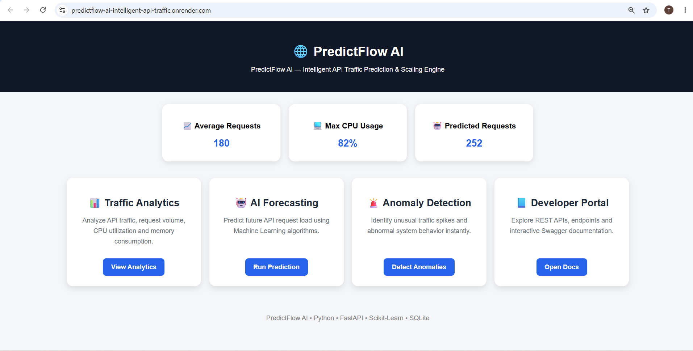
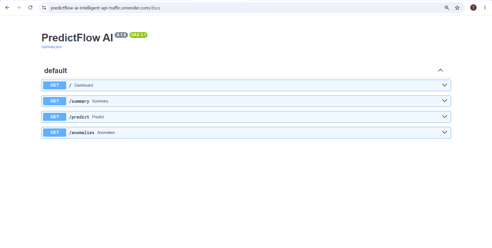
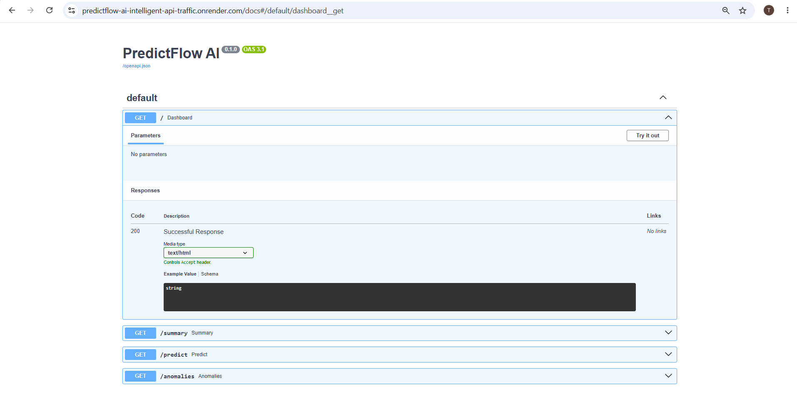
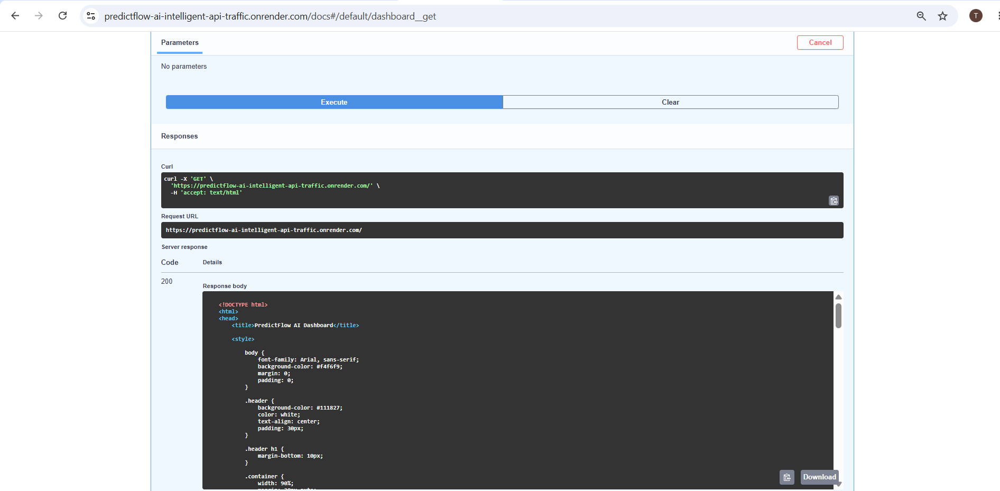

# 🚀 PredictFlow AI

### Intelligent API Traffic Prediction & Monitoring Platform

<p align="center">
  
  
  
  
  
</p>

<p align="center">
  <b>AI-Powered API Traffic Monitoring, Forecasting & Anomaly Detection Platform</b>
</p>

---

## 🌟 Live Demo

### 🌐 Application URL

```text
https://predictflow-ai-intelligent-api-traffic.onrender.com/
```

### 📘 API Documentation

```text
PASTE_YOUR_RENDER_URL_HERE/docs
```

---

## 📌 Project Overview

PredictFlow AI is an AI-powered API traffic monitoring and prediction platform designed to analyze historical traffic patterns, forecast future API request loads, and identify unusual traffic behavior using Machine Learning.

The project simulates a real-world backend monitoring system where organizations need to track API performance, detect anomalies, and proactively scale infrastructure based on traffic predictions.

---

## 🎯 Project Objective

The primary objective of this project is to:

- Monitor API traffic metrics
- Analyze server resource utilization
- Predict future request load using Machine Learning
- Detect abnormal traffic patterns
- Provide API insights through an interactive dashboard
- Demonstrate end-to-end backend development skills

---

# ✨ Key Features

### 📊 Traffic Analytics

- Analyze API request patterns
- Calculate average traffic volume
- Monitor CPU utilization
- Track memory consumption

### 🤖 AI Traffic Forecasting

- Predict future API request volume
- Machine Learning-based forecasting
- Trend analysis using historical traffic data

### 🚨 Anomaly Detection

- Detect unusual traffic spikes
- Identify abnormal behavior
- Automated anomaly monitoring

### 🗄️ Database Integration

- SQLite database support
- Traffic data persistence
- Structured data management

### 🌐 REST API Development

- FastAPI-based backend
- Multiple API endpoints
- JSON responses

### 📘 Interactive API Documentation

- Auto-generated Swagger UI
- API testing interface
- Developer-friendly documentation

### 🎨 Dashboard Interface

- Interactive dashboard
- Traffic metrics visualization
- Professional web interface

---

# 🏗️ System Architecture


```text
                           +------------------+
                           | traffic_logs.csv |
                           | Historical Data  |
                           +--------+---------+
                                    |
                                    v

                    +------------------------------+
                    |      Traffic Analyzer        |
                    | (Pandas + NumPy Analysis)    |
                    +--------------+---------------+
                                   |
         +-------------------------+-------------------------+
         |                                                   |
         v                                                   v

+----------------------+                     +----------------------+
|  Prediction Engine   |                     |   Anomaly Detector   |
| (Scikit-Learn ML)    |                     |  (Isolation Forest)  |
+----------+-----------+                     +----------+-----------+
           |                                            |
           +----------------+---------------------------+
                            |
                            v

                 +------------------------+
                 | SQLite Database Layer  |
                 |      database.py       |
                 |      traffic.db        |
                 +-----------+------------+
                             |
                             v

                   +--------------------+
                   |    FastAPI APIs    |
                   |      main.py       |
                   +----------+---------+
                              |
          +-------------------+-------------------+
          |                                       |
          v                                       v

+----------------------+             +----------------------+
| Dashboard Interface  |             | Swagger API Docs    |
|   dashboard.html     |             |       /docs         |
+----------------------+             +----------------------+
```

---

# 🛠️ Technologies Used

## Backend

- Python
- FastAPI
- REST APIs

## Data Processing

- Pandas
- NumPy

## Machine Learning

- Scikit-Learn
- Linear Regression
- Isolation Forest

## Database

- SQLite

## Development Tools

- VS Code
- Git
- GitHub

## Deployment

- Render

---

# 📂 Project Structure

```text
PREDICTFLOW-AI/
│
├── backend/
│   ├── services/
│   │   ├── anomaly_detector.py      # Anomaly detection logic
│   │   ├── prediction_engine.py     # ML prediction engine
│   │   └── traffic_analyzer.py      # Traffic analytics
│   │
│   ├── tests/
│   │   └── test_prediction.py       # Unit testing
│   │
│   ├── utils/
│   │   ├── decorators.py            # Custom decorators
│   │   └── exceptions.py            # Custom exceptions
│   │
│   ├── check_db.py                  # Database connectivity test
│   └── database.py                  # SQLite database operations
│
├── templates/
│   └── dashboard.html               # Frontend dashboard UI
│
├── main.py                          # FastAPI entry point
├── traffic_logs.csv                 # Dataset file
├── traffic.db                       # SQLite database
├── requirements.txt                 # Python dependencies
├── runtime.txt                     # Python version config
├── .gitignore                       # Git ignored files
└── README.md                        # Project documentation
```

---

# 🔌 API Endpoints

| Endpoint | Description |
|-----------|------------|
| `/` | Dashboard |
| `/summary` | Traffic Analytics |
| `/predict` | Request Forecasting |
| `/anomalies` | Anomaly Detection |
| `/docs` | Swagger Documentation |

---

# 🧠 Machine Learning Components

## Prediction Engine

Uses Machine Learning techniques to forecast future API request traffic based on historical trends.

### Output Example

```json
{
  "predicted_requests": 265
}
```

---

## Anomaly Detection Engine

Uses anomaly detection logic to identify unusual traffic spikes.

### Output Example

```json
[
  {
    "requests": 450,
    "status": "anomaly"
  }
]
```

---

# 📈 Project Highlights

✅ End-to-End Backend Development

✅ FastAPI REST API Design

✅ Machine Learning Integration

✅ Data Analysis using Pandas

✅ SQLite Database Connectivity

✅ Interactive Dashboard

✅ Swagger Documentation

✅ Git Version Control

✅ GitHub Project Management

✅ Cloud Deployment

---

# 🎓 Skills Learned

Through this project, I gained practical experience in:

- Python Development
- Backend Engineering
- FastAPI Framework
- REST API Design
- Data Analysis
- Machine Learning Fundamentals
- Database Integration
- Error Handling
- Testing & Debugging
- Git & GitHub
- Cloud Deployment
- Software Project Structure

---

# 🚀 Local Setup

## Clone Repository

```bash
git clone <repository-url>
cd predictflow-ai
```

## Install Dependencies

```bash
pip install -r requirements.txt
```

## Run Application

```bash
uvicorn main:app --reload
```

---

# 🌍 Live Deployment

### Application URL

```text
PASTE_YOUR_RENDER_URL_HERE
```

### Swagger Documentation

```text
PASTE_YOUR_RENDER_URL_HERE/docs
```

---

## 📸 Screenshots

### 1. Dashboard


### 2. Swagger Documentation  


### 3. API Docs


### 4. API Response


---

# 📊 Final Outcome

PredictFlow AI successfully demonstrates how modern backend systems can combine:

- API Development
- Data Analytics
- Machine Learning
- Database Integration
- Cloud Deployment

to build an intelligent traffic monitoring and prediction platform.

This project serves as a practical implementation of real-world backend engineering and AI-assisted monitoring systems.

---

# 👩‍💻 Author

**Lavanya Thalamanchi**

Python Developer | Backend Developer | AI Enthusiast

GitHub: https://github.com/Thalamanchi-Lavanya

---

⭐ If you found this project useful, consider giving it a star on GitHub.
